<div align="center">

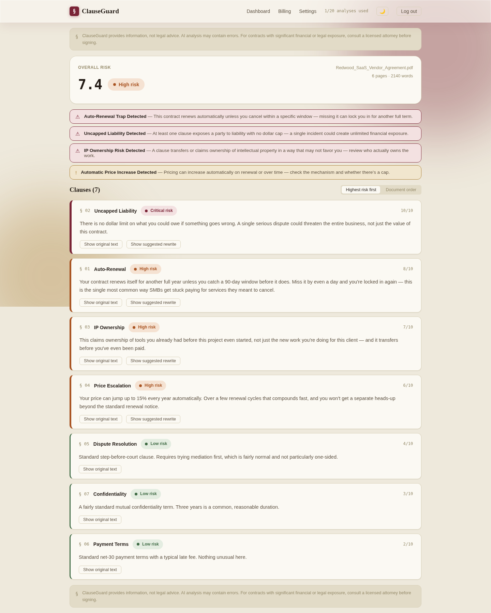

# ClauseGuard

**You sign contracts alone. This reads them with you.**

AI contract risk analysis for the business that can't afford $400/hour to find out what "uncapped liability" means before it's too late.

[](backend/tests)
[](#under-the-hood)
[](backend/app/ai_client.py)
[](#license)

</div>

<br/>

## The 30-second version

A small business owner gets a vendor contract. No lawyer on staff, no
$400/hr to spend finding out what they're agreeing to. They drop the PDF
into ClauseGuard. Ninety seconds later they know exactly which three
clauses will actually hurt them, in English a human wrote for humans —
not legal Latin, not a wall of text they'll skim past.

That's the product. Everything below is how it actually works, not how
it's supposed to sound.

<br/>

## Watch it move


*Every GIF in this file is a real recording — captured frame-by-frame from
an actual headless browser driving the actual build. None of these are
design-tool exports.*

<br/>

## Why this exists

Contracts don't fail loudly. They fail quietly, months later, when the
auto-renewal window you didn't know about closes and you're locked in for
another year, or the liability clause you skimmed past turns one bad month
into an existential one. Auto-renewal traps alone have cost real companies
six figures over a single missed cancellation window. Enterprise contract
intelligence tools exist — they start around $25,000 a year, built for
legal departments that already have legal departments.

ClauseGuard is built for the other 90%: the freelancer signing a client
agreement, the ten-person SaaS company reviewing a vendor deal, the founder
staring at an investor side letter at 11pm. People with enough business
sense to read a risk score, and not enough spare cash to hire someone to
read it for them.

<br/>

## Light and dark, properly

<table>
<tr>
<td width="50%">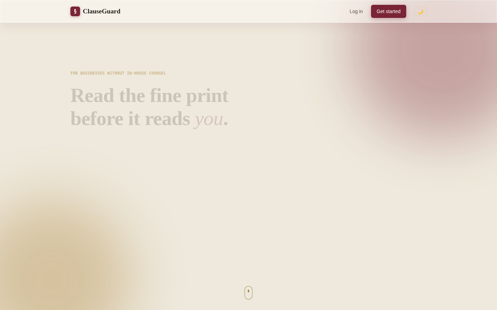</td>
<td width="50%">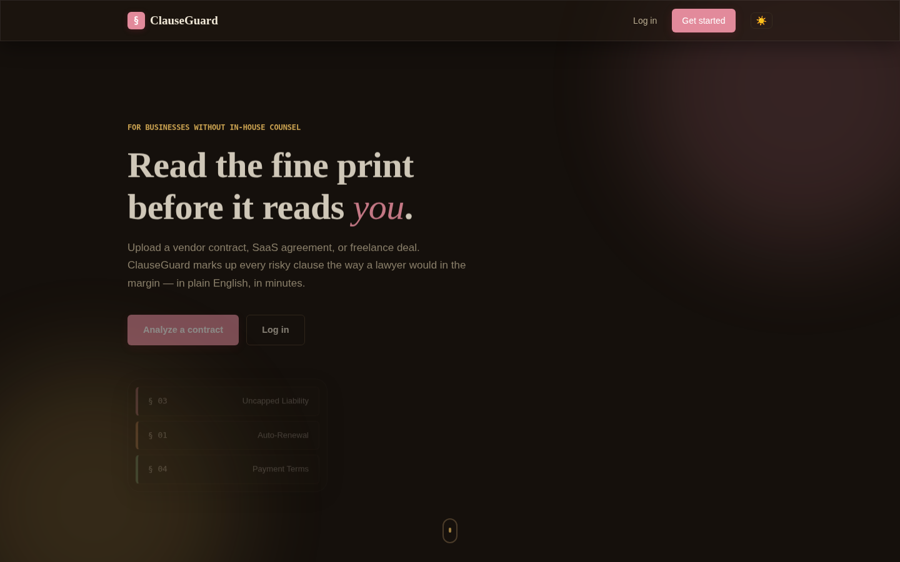</td>
</tr>
<tr>
<td align="center"><sub>Light — warm parchment, oxblood, aged brass</sub></td>
<td align="center"><sub>Dark — a different mood, not an inverted filter</sub></td>
</tr>
</table>

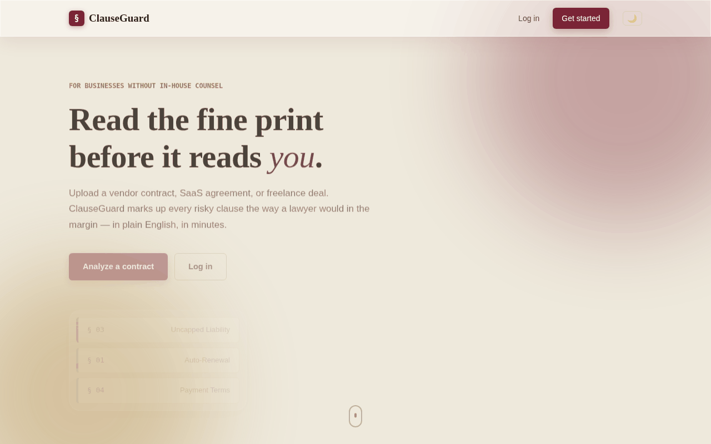

The palette is deliberate: wax-seal oxblood, aged-ledger brass, warm ink —
grounded in the actual subject (reading a contract like a lawyer redlines
one) instead of the indigo-gradient-on-cream look every AI-assisted build
seems to land on by default. Every risk color in the product (low / medium
/ high / critical) comes from that same family, so the functional
color-coding reads as one considered system, not a traffic light bolted
onto a template.

<br/>

## The actual product, not the marketing version

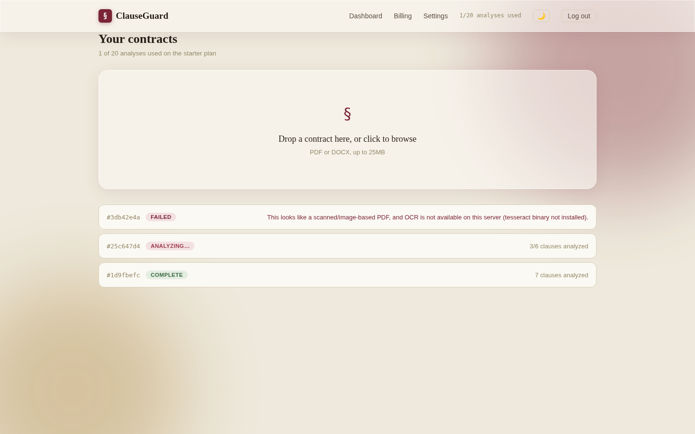

That's not a staged screenshot with one perfect success state. Three real
documents in three real states a user actually hits: fully analyzed,
mid-analysis, and failed with the exact error the backend produces (OCR
unavailable on this server — a real failure message, not a placeholder).

### Read a contract like a lawyer redlines one

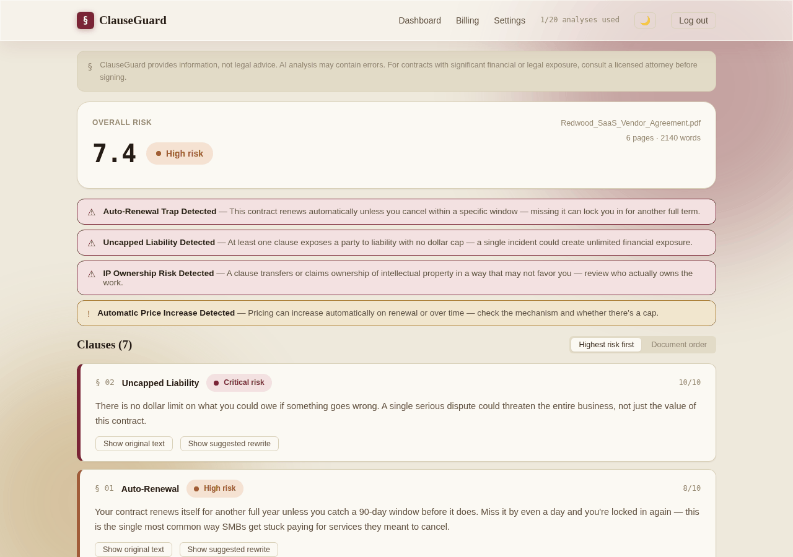

Every risky clause carries the original legal text and a suggested,
plainer rewrite — collapsed by default so the page reads as a risk
summary first, not a wall of text. Click to expand either one.

### Flags jump you straight to the clause that caused them


### Sort by what actually matters

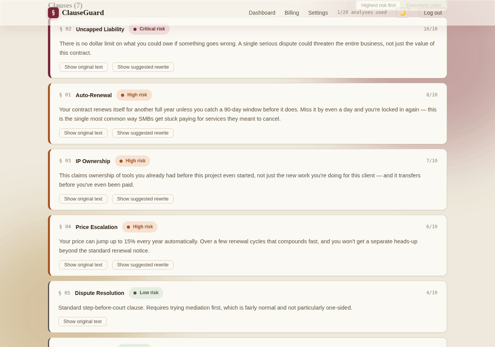

Default view is highest-risk-first, because the clause that could bankrupt
you matters more than the one at the top of page one. Document order is
one click away for when you want to read it the way it was written.

<br/>

## Every screen, not just the good ones

<table>
<tr>
<td width="33%">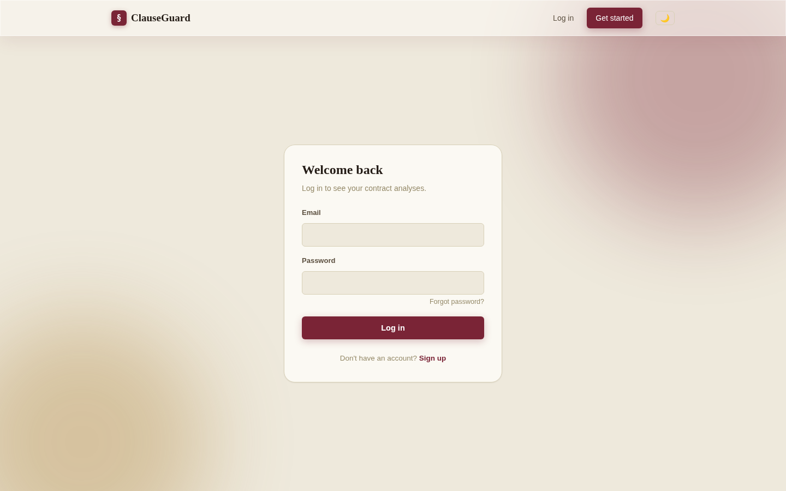<p align="center"><sub>Login</sub></p></td>
<td width="33%">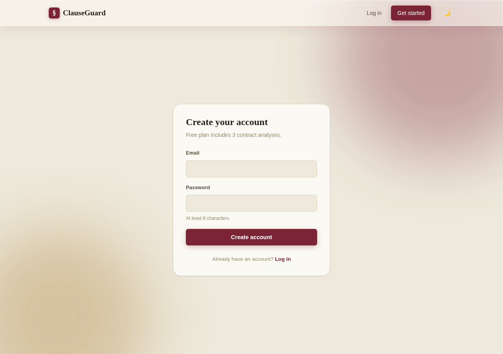<p align="center"><sub>Register</sub></p></td>
<td width="33%">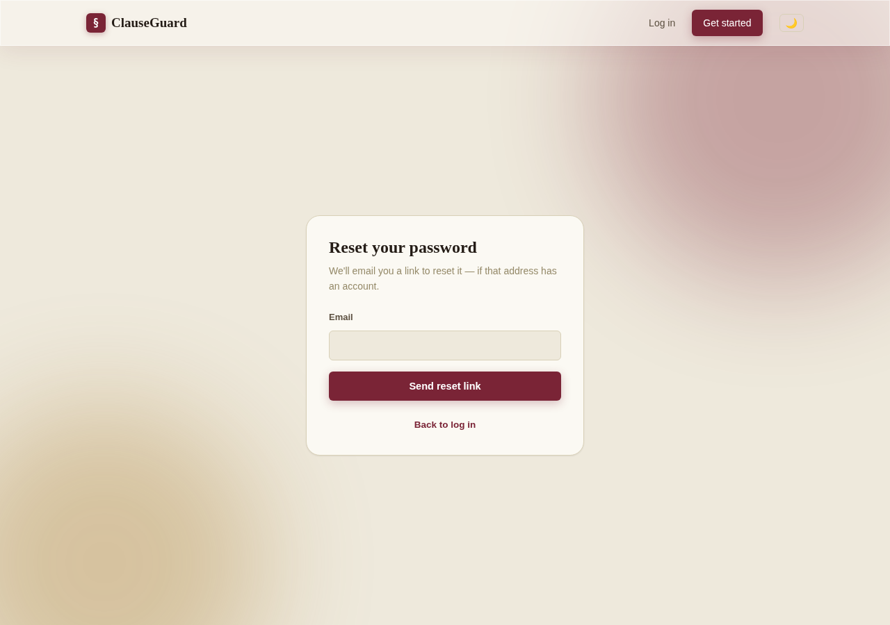<p align="center"><sub>Forgot password</sub></p></td>
</tr>
</table>

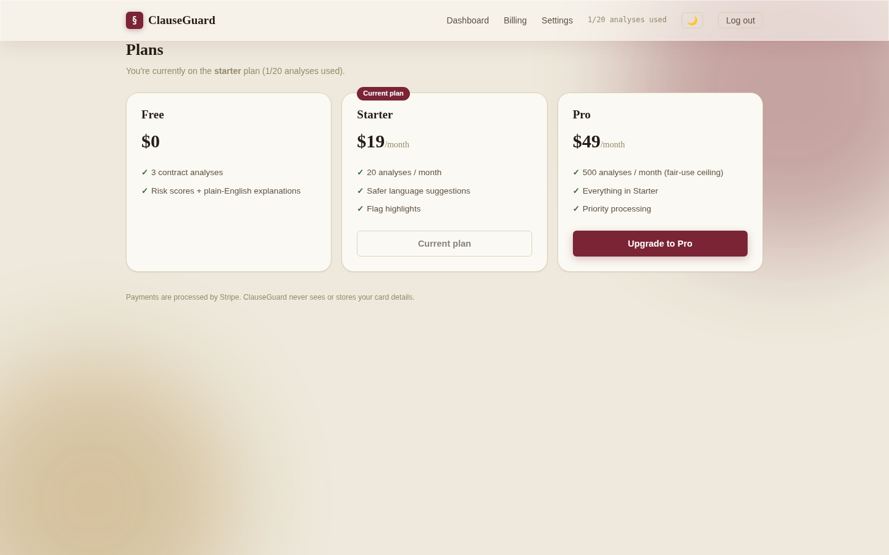

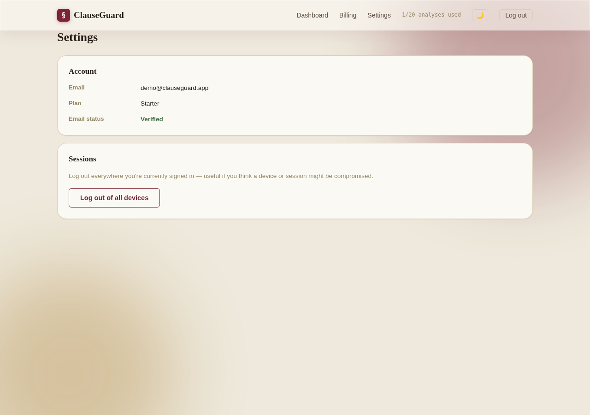

Settings isn't an afterthought page with just an email field on it — it's
where "log out of every device" actually lives, because a password reset
or a suspected compromise needs a real answer, not a support ticket.

<br/>

## It actually responds


That's a live browser window shrinking from 1280px down to 390px, captured
frame by frame — not three separate breakpoint mockups stitched together.

<br/>

## How it's actually built

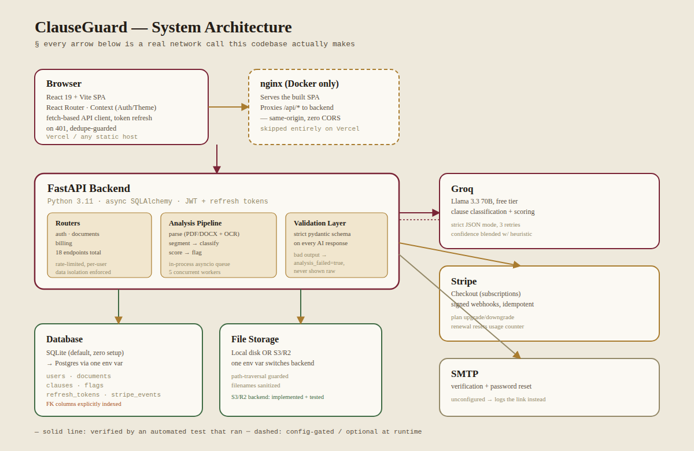

No Redis. No Celery. No AWS bill. Every box in that diagram is something
this codebase genuinely runs, not an aspirational infra slide.

### What happens between "upload" and "here's your risk score"

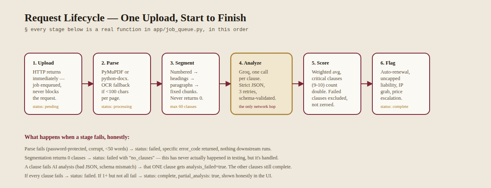

### The data underneath it

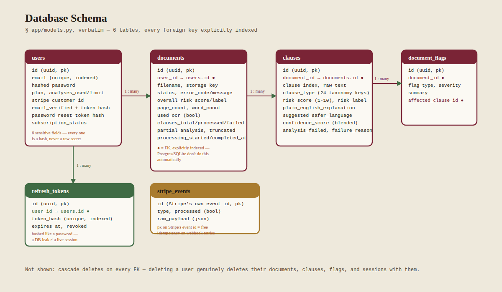

Six tables. Every foreign key explicitly indexed — Postgres and SQLite
don't do that automatically, and it's the kind of omission that only
shows up once you have enough rows for it to hurt. Refresh tokens are
hashed the same way passwords are, on purpose: a database leak shouldn't
hand out working sessions any more than it should hand out plaintext
credentials.

<br/>

## What's verified, not asserted

Every number here came from actually running the thing, in this exact
repo, right before writing this file:

```
53 backend tests — passing
20 API endpoints — all registered, all reachable
24-type clause taxonomy — auto-renewal, uncapped liability, IP grabs,
                           price escalation, and 20 more
0 build errors  — frontend production build
0 lint errors   — oxlint, both frontend and backend paths checked
```

Test coverage isn't just the happy path. Two users can't see each other's
documents (404, not 403 — never confirms a document even exists to the
wrong person). A password reset kills every other active session. An old
refresh token is provably dead the instant a new one is issued. A Stripe
webhook with a forged signature gets rejected before it ever touches the
database.

Two real bugs got caught building this, by tests, not by luck: a SQLite
timezone quirk that silently threw `TypeError` on password-reset expiry
checks, and two access tokens issued in the same second that were
byte-for-byte identical because nothing made them unique. Both are fixed.
Both are why the test count matters more than the feature list.

<br/>

## Under the hood

| | |
|---|---|
| **Backend** | FastAPI · async SQLAlchemy · SQLite (Postgres-ready) · JWT + rotating refresh tokens |
| **AI** | Groq (Llama 3.3 70B), strict JSON-schema validation, retry with backoff, zero paid API dependency |
| **Parsing** | PyMuPDF for PDF, python-docx for Word, Tesseract OCR fallback (feature-detected, never assumed) |
| **Payments** | Stripe Checkout + signed, idempotent webhooks |
| **Frontend** | React 19 · Vite · React Router · zero CSS framework — hand-written design tokens |
| **Fonts** | Fraunces (display) · Archivo (body) · IBM Plex Mono (clause numbering — because contracts are genuinely numbered) |
| **Deploy** | Docker Compose for the full stack, `vercel.json` for the frontend alone, `render.yaml` for the backend |

<br/>

## Running it yourself

**Want it live on the internet, step by step, no jargon?** →
[`DEPLOYMENT.md`](DEPLOYMENT.md) — GitHub, Render, Vercel, Neon, and
Cloudflare R2, all free tiers, every step checked against this exact repo.

Just want it running locally first:

```bash
git clone <this-repo>
cd clauseguard

# Backend
cd backend
python3 -m venv venv && source venv/bin/activate
pip install -r requirements.txt
cp .env.example .env    # add a free Groq key: console.groq.com/keys
uvicorn app.main:app --reload

# Frontend (new terminal)
cd frontend
npm install
npm run dev
```

Or skip both of those and run `docker compose up --build` from the repo
root. Full walkthroughs, including Stripe test-mode setup and the
Vercel/Render deployment paths, are in `backend/README.md` and
`frontend/README.md`.

<br/>

## Pushing to GitHub, then deploying the frontend to Vercel

Checked specifically for this, not assumed:

- **No secrets in the repo.** Scanned for hardcoded API keys, Stripe
  secrets, and JWT secrets — clean. Every `.env.example` ships with empty
  placeholders, never fake-real-looking values.
- **`.gitignore` actually works, verified by simulating it** — ran a real
  `git add -A` and checked what got staged. 123 files, all legitimate,
  zero `.env` files, zero databases, zero `node_modules` or `venv`. Not
  "the gitignore file looks right," but "I staged everything and checked."
- **`LICENSE` file added.** The README claimed MIT before an actual
  `LICENSE` file existed — a real inconsistency, now fixed.
- **Node version pinned defensively.** This frontend runs on Vite 8, which
  requires Node 20.19+ or 22.12+ specifically (not just "Node 20+").
  Vercel's current default for new projects is Node 24.x, which clears
  that bar — but `engines.node` is now set explicitly in `package.json` in
  case your Vercel team has an older project default.
- **Repo size is 5.9MB, largest single file 1.2MB** — nowhere near
  GitHub's 50MB warning or 100MB hard limit, even with 8 real GIFs in
  `docs/`.
- **Built with a genuine external URL, not localhost.** Set
  `VITE_API_URL` to a fake `https://example-backend.onrender.com` and
  confirmed it's actually compiled into the JS bundle, not silently
  falling back to a local default — the exact failure mode that would
  otherwise only show up after a real deploy.

<br/>

## What this is not

No sugarcoating, since that's the whole point of writing it this way:

- **Docker Compose has never been run against a real Docker daemon in the
  environment this was built in.** Every file is statically validated —
  YAML parses, every referenced path exists, both Dockerfiles follow
  patterns verified elsewhere — but `docker compose up` completing
  successfully on your machine is the one claim in this README I can't
  personally back with a passing test.
- **No real Groq key, no real Stripe account, no real Cloudflare R2 bucket
  has ever touched this code.** The AI client is tested against a mocked
  response; billing logic is tested with forged-but-structurally-correct
  webhook payloads; the S3/R2 storage backend is tested against a mocked
  S3 API (7 tests, `backend/tests/test_s3_storage.py`). All three prove
  the code's logic is correct. None of them prove a live account won't
  surprise you with a rate limit, a permissions quirk, or a timeout that
  only shows up in the real world.
- **Object storage now has a real S3/R2 backend, not just an interface
  shaped for one.** `STORAGE_BACKEND=s3` in `.env` switches it on — see
  `backend/README.md`'s "Deploying for real" section for the five-minute
  Cloudflare R2 setup. Local disk remains the zero-config default for
  quick testing.
- **Multi-column PDFs and embedded tables will produce degraded text.**
  The parser detects and flags the likely-scrambled pages instead of
  pretending it handled them — that's the honest v1 answer, not a fix.
- **This is not legal advice, and the product says so on every single
  results page, permanently, non-dismissibly** — because getting that
  disclaimer wrong is the one mistake in this entire codebase that could
  actually hurt someone.

<br/>

## Project structure

```
clauseguard/
├── backend/
│   ├── app/
│   │   ├── routers/          # auth, documents, billing — 20 endpoints
│   │   ├── ai_client.py      # Groq integration, schema validation, retries
│   │   ├── segmentation.py   # clause splitting — numbered/heading/paragraph/fallback
│   │   ├── scoring.py        # weighted risk aggregation
│   │   ├── parsing.py        # PDF/DOCX + OCR, feature-detected
│   │   ├── billing.py        # Stripe event handling, testable without live Stripe
│   │   └── job_queue.py      # in-process async worker pool
│   ├── tests/                 # 53 tests, 9 files
│   └── render.yaml
├── frontend/
│   ├── src/
│   │   ├── pages/             # Landing, Dashboard, Results, Billing, Settings, Auth flows
│   │   ├── components/        # ClauseCard, RiskBadge, FlagBanner, Reveal (scroll animation)
│   │   └── styles/tokens.css  # the entire design system, one file
│   └── vercel.json
├── docker-compose.yml
└── docs/
    ├── architecture.png       # system architecture
    ├── pipeline.png           # request lifecycle, stage by stage
    ├── database-schema.png    # all 6 tables, real relationships
    └── screenshots/           # every screen, several as real recorded GIFs
```

<br/>

## License

MIT. Build something with it.

<div align="center">
<sub>Built clause by clause, tested the same way.</sub>
</div>
